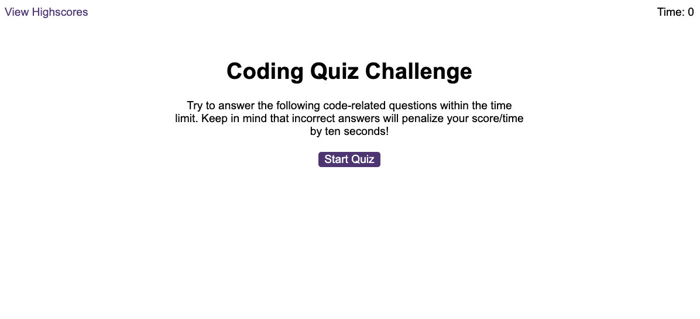

# Code Quiz App

## Description

The purpose of this tas was to create a working quiz with a timer which may drop down if the chosen answer was incorrect. This was done using a selection of questions in a javascript file and a javascript logic file. The results would then be stored in local storage within the browser with an option to clear the storage.

## Mockup

The image below shows an image of the working application.

## Review

This task really got me to think outside the box and made use of all the JavaScript skills I have learned. Google was used to do some research where I learned how to achieve some of the functnality of this task as well as the course content.

## Deployment

[Coading Quiz Application - https://wmohammad83.github.io/code-quiz/](https://wmohammad83.github.io/code-quiz/)

## Resources Used

[Markdown Badges](https://github.com/Ileriayo/markdown-badges)

